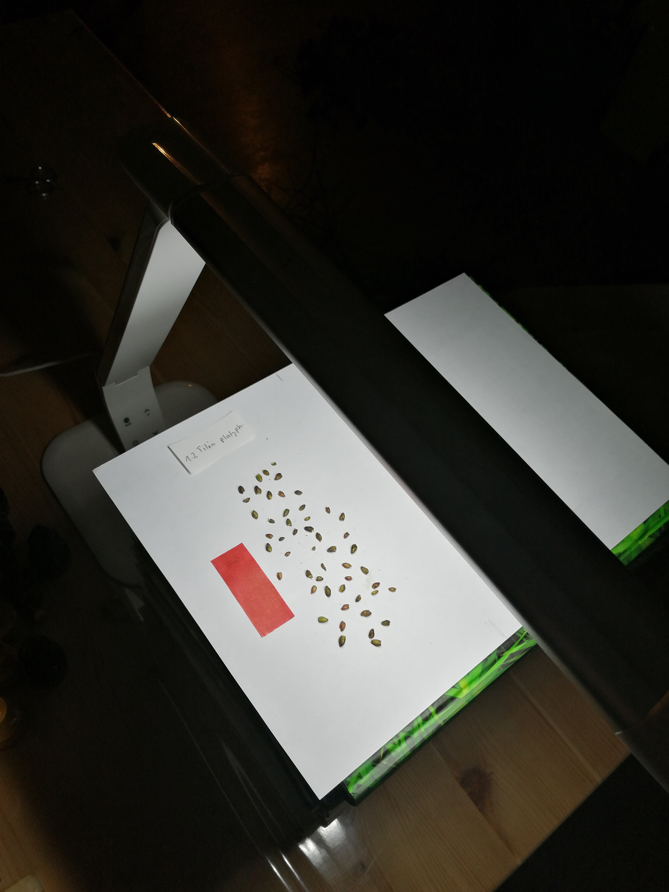
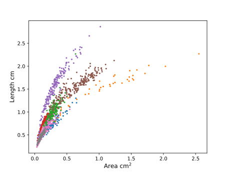
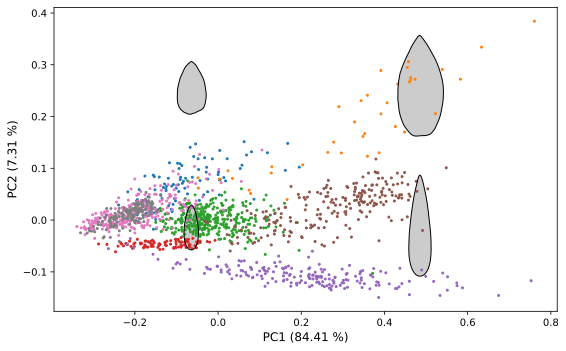

# Buds morphometrics
This was my project in the course Bioimage Analysis at the University of Potsdam. The goal was to distinguish common tree species with images of buds. The project report can be found here: [report](Bud_morphometrics_report.pdf) and a presentation of the project: [presentation](Bud_morphometrics_presentation.pdf). The images were made on blank paper:

Here are some results from the project, for more details look into the project report!

