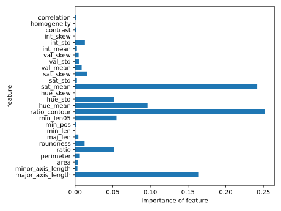

# Buds morphometrics
This was my project in the course Bioimage Analysis at the University of Potsdam. The goal was to distinguish common tree species with images of buds. The images were made on blank paper:

